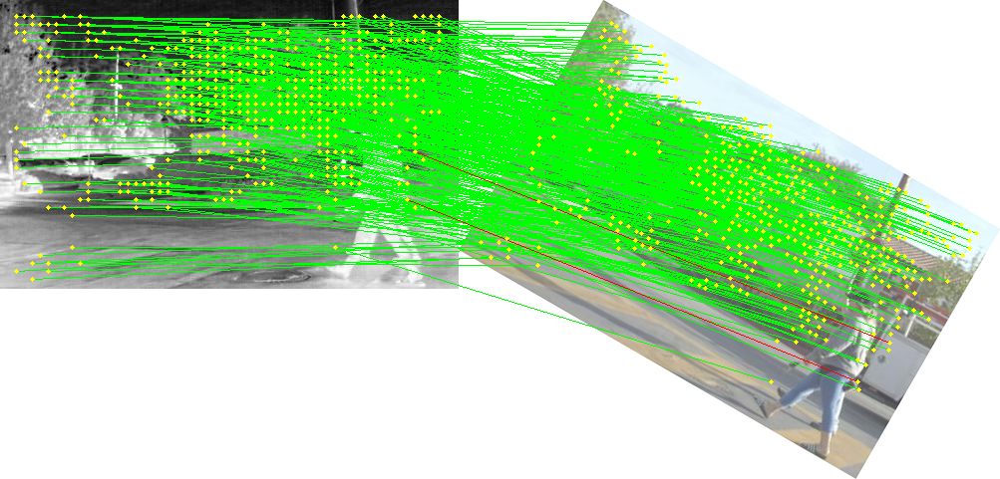
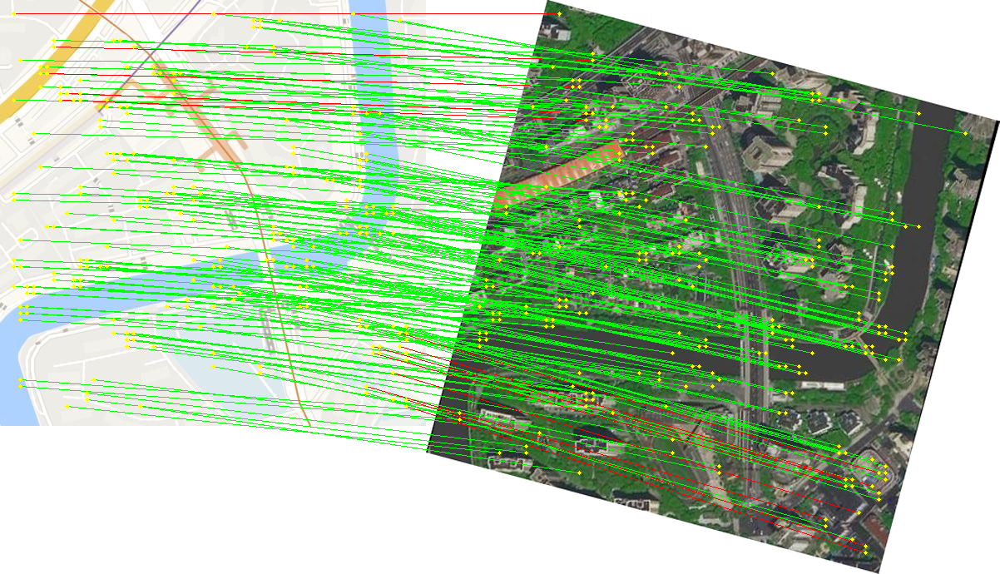
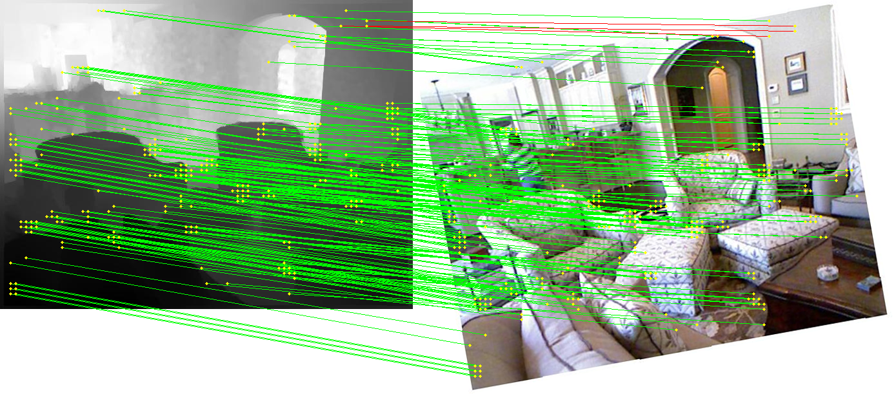

# VMGGA 

🚧 This page is under recent updates and is currently incomplete.

[English](README.md) | [中文](README_CN.md)

## Robust Detector-Free Multimodal Image Matching Based on Visual Model Guidance and Gated Attention

[](https://doi.org/10.1016/j.isprsjprs.2026.05.005)


Official implementation of **VMGGA**, published in *ISPRS Journal of
Photogrammetry and Remote Sensing*. [[Paper Link]](https://doi.org/10.1016/j.isprsjprs.2026.05.005)

**Tengfeng Tang, Zhiqiang Han, Tao Peng, Jinhao Chen, and Yuanxin Ye**


<!--
Add assets/teaser.png and uncomment the following block.
<p align="center">
  
</p>
-->

## Overview

VMGGA is a detector-free framework for robust multimodal image matching.
It combines:

- **Visual Model Guidance:** a dual-stream backbone fusing DINOv3 semantic
  priors with local geometric features.
- **Gated Linear Attention:** an input-dependent gate that suppresses
  irrelevant global information during feature interaction.
- **Coarse-to-fine matching:** robust coarse correspondence followed by
  pixel-level refinement.

The method is evaluated on four multimodal settings:

| Modality | Repository key | Example directory |
|---|---|---|
| Optical-Infrared | `optical_infrared` | `examples/optical_infrared/` |
| Optical-SAR | `optical_sar` | `examples/optical_sar/` |
| Optical-Map | `optical_map` | `examples/optical_map/` |
| Optical-Depth | `optical_depth` | `examples/optical_depth/` |

## Qualitative Results

<!--
Replace the placeholders below with:
assets/results_optical_infrared.png
assets/results_optical_sar.png
assets/results_optical_map.png
assets/results_optical_depth.png
-->

|                                                                                                                     Optical-Infrared                                                                                                                      | Optical-SAR |
|:---------------------------------------------------------------------------------------------------------------------------------------------------------------------------------------------------------------------------------------------------------:|:---:|
| <br>Reference image: RoadScene/inf/FLIR_05027.jpg<br>Sensed image: RoadScene/opt/FLIR_05027.jpg<br>Simulated transformation: rotation -30 degrees<br>Inliers / correct matches: 422 / 420 | <br>Reference image: OSdataset/opt/10.png<br>Sensed image: OSdataset/sar/10.png<br>Simulated transformation: rotation 15 degrees, scale 1.2, x-perspective contraction 0.001, y-perspective contraction 0.001<br>Inliers / correct matches: 125 / 125 |

| Optical-Map | Optical-Depth |
|:---:|:---:|
| <br>Reference image: VMGGA-Opt-Map/map/109747_53549.jpg<br>Sensed image: VMGGA-Opt-Map/opt/109747_53549.jpg<br>Simulated transformation: rotation -15 degrees, scale 1.1<br>Inliers / correct matches: 216 / 227 | <br>Reference image: NYU-DEPTH-V2/depth/1340.jpg<br>Sensed image: NYU-DEPTH-V2/opt/1340.jpg<br>Simulated transformation: rotation 10 degrees, scale 1.1, x-perspective contraction 1e-5<br>Inliers / correct matches: 230 / 227 |

## Model Zoo

Download a checkpoint and place it in `weight/` using the filename below.
Each VMGGA checkpoint contains the complete inference model state; a separate
DINOv3 initialization checkpoint is not required for inference.

| Modality | Filename | Google Drive | Baidu Netdisk |
|---|---|---|---|
| Optical-Infrared | `vmgga_optical_infrared.pth` | TBA | [[Baidu Netdisk]](https://pan.baidu.com/s/15bRXjeRvDZEGtVCthVKivA?pwd=w9nz) |
| Optical-SAR | `vmgga_optical_sar.pth` | TBA | [[Baidu Netdisk]](https://pan.baidu.com/s/1udp4OAzw_EL9QEI3FyG4Wg?pwd=bf8d) |
| Optical-Map | `vmgga_optical_map.pth` | TBA | [[Baidu Netdisk]](https://pan.baidu.com/s/1glLw0G4QgQMEN0KoABVlMQ?pwd=3arf) |
| Optical-Depth | `vmgga_optical_depth.pth` | TBA | [[Baidu Netdisk]](https://pan.baidu.com/s/1UEvwXzfVZRlh-hrUC-WzMQ?pwd=dbff) |

## Dataset

The self-made VMGGA-Opt-Map dataset used in the paper will be provided through
external cloud storage links.

| Dataset | Description                                        | Google Drive | Baidu Netdisk |
|---|----------------------------------------------------|---|---|
| VMGGA-Opt-Map | Optical satellite image and raster map image pairs | [[Google Drive]](https://drive.google.com/file/d/1i1YBPVZEp4QVVslDBRkZSd5NqO18r4FP/view?usp=sharing) | [[Baidu Netdisk]](https://pan.baidu.com/s/12QzsTaHCWXmIRi4ZLaTlvA?pwd=55ht) |

## Installation

```bash
git clone https://github.com/yeyuanxin110/VMGGA.git
cd VMGGA

conda create -n vmgga python=3.10 -y
conda activate vmgga
```

Install PyTorch for your CUDA version from the
[official installation guide](https://pytorch.org/get-started/locally/), then:

```bash
pip install -r requirements.txt
```

The code was tested with Python 3.10, PyTorch 2.8.0, CUDA 12.6,
OpenCV 4.12.0, einops 0.8.1, Kornia 0.8.1, and pydegensac.

## Demo

We provide built-in example image pairs so you can try VMGGA in 3 steps:

**Step 1 — Download a checkpoint**

Pick the modality you want to try, download the corresponding `.pth` file
from the Model Zoo above, and place it in `weight/`.

**Step 2 — (Optional) Prepare your own images**

If you want to use your own images, place them under the modality example
directory. For instance, for optical-SAR:

```text
examples/optical_sar/
├── image0.png          # reference image
└── image1.png          # sensed image
```

> If you skip this step, the built-in example pair is used automatically.

**Step 3 — Set modality and run**

Open `demo_vmgga.py` and go to the `main()` function. Fill in the required
parameters at the top:

```python
# =====================================================================
#  必填 / REQUIRED
# =====================================================================
modality = "optical_sar"                               # ← choose your modality

image0 = "examples/optical_sar/image0.png"             # ← reference image
image1 = "examples/optical_sar/image1.png"             # ← sensed image

mode = 1                                               # ← matching mode

if mode == 1:
    # ── Mode 1 parameters (required) ──
    rotate = 15         # rotation angle (degrees)
    scale = 1.2         # scale factor
    homography_x = 0.0  # perspective contraction x
    homography_y = 0.0  # perspective contraction y

elif mode == 2:
    # ── Mode 2 parameters (required) ──
    homography_label = "examples/optical_sar/homography.txt"  # label file path
    invert_label = False                                      # invert direction
```

Then run:

```bash
python demo_vmgga.py
```

The result is saved to `demo_result/<modality>_matches.png`.

**Which mode should I use?**

| Mode | When to use |
|------|-------------|
| `1` (default) | Your image pair is roughly aligned. The script applies synthetic rotation, scale, and perspective perturbations automatically. Accuracy is reported against the known ground truth. |
| `2` | Your image pair is unaligned and you have a homography label file (`.npy`, `.npz`, `.txt`, or `.csv`). Set `homography_label` to your file path. |
| `3` | You just want to see the matches between two images. No accuracy metric is computed — all RANSAC inliers are drawn in green. |

## Repository Structure

```text
VMGGA/
├── assets/                 # README figures
├── examples/               # Sample pairs for four modalities
├── LICENSES/               # Third-party license files
├── src/
│   ├── config/             # Model setup
│   ├── utils/              # Image transformation utilities
│   └── vmgga/              # VMGGA network
├── weight/                # Downloaded checkpoints (not tracked by Git)
├── demo_vmgga.py
├── requirements.txt
└── README.md
```

## Citation

If this work is useful for your research, please cite:

```bibtex
@article{tang2026vmgga,
  title   = {Robust Detector-Free Multimodal Image Matching Based on Visual Model Guidance and Gated Attention},
  author  = {Tang, Tengfeng and Han, Zhiqiang and Peng, Tao and Chen, Jinhao and Ye, Yuanxin},
  journal = {ISPRS Journal of Photogrammetry and Remote Sensing},
  volume  = {238},
  pages   = {484--496},
  year    = {2026},
  doi     = {10.1016/j.isprsjprs.2026.05.005}
}
```

## License

The project code is released under the Apache License 2.0. DINOv3-derived
files under `src/vmgga/backbone/dinov3/` remain subject to the DINOv3 License;
see `LICENSES/DINOv3_LICENSE.md`.

## Contact

- Tengfeng Tang (First Author): `ttf@my.swjtu.edu.cn`
- Prof. Yuanxin Ye (Corresponding Author): `yeyuanxin@home.swjtu.edu.cn`
