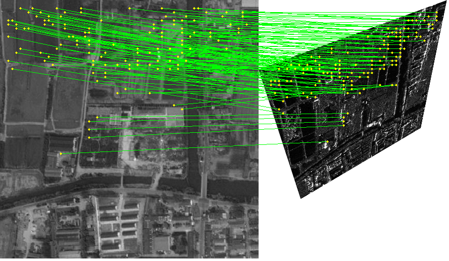

# VMGGA

[English](README.md) | [简体中文](README_CN.md)

## 基于视觉模型引导与门控注意力的鲁棒无检测器多模态图像匹配

[](https://doi.org/10.1016/j.isprsjprs.2026.05.005)


本仓库是论文 **VMGGA** 的官方实现。论文发表于
*ISPRS Journal of Photogrammetry and Remote Sensing*。

**Tengfeng Tang, Zhiqiang Han, Tao Peng, Jinhao Chen, Yuanxin Ye**

[[论文]](https://doi.org/10.1016/j.isprsjprs.2026.05.005)
[[权重：Google Drive（待更新）]](#模型权重)
[[权重：百度网盘（待更新）]](#模型权重)

<!--
将总体效果图保存为 assets/teaser.png，并取消下面代码的注释。
<p align="center">
  
</p>
-->

## 方法简介

VMGGA 是面向多模态图像匹配的无检测器框架，主要包括：

- **视觉模型引导：** 双流骨干网络融合 DINOv3 高层语义先验与局部几何特征。
- **门控线性注意力：** 使用输入相关的门控机制抑制特征交互中的无关全局信息。
- **由粗到细匹配：** 先建立鲁棒粗匹配，再进行像素级精细定位。

本文在四类多模态场景中进行了实验：

| 模态 | 仓库标识 | 示例目录 |
|---|---|---|
| 光学-红外 | `optical_infrared` | `examples/optical_infrared/` |
| 光学-SAR | `optical_sar` | `examples/optical_sar/` |
| 光学-地图 | `optical_map` | `examples/optical_map/` |
| 光学-深度 | `optical_depth` | `examples/optical_depth/` |

## 定性结果

<!--
请将四类模态效果图保存为：
assets/results_optical_infrared.png
assets/results_optical_sar.png
assets/results_optical_map.png
assets/results_optical_depth.png
-->

| 光学-红外 | 光学-SAR |
|:---:|:---:|
| *效果图待补充* |  |
| *效果图待补充* |基准图: OSdataset/opt/10.png, 实时图: OSdataset/sar/10.png|
| *效果图待补充* |模拟变换: 旋转15°, 尺度1.2倍, x方向透视收缩0.001, y方向透视收缩0.001|
| *效果图待补充* |内点数 / 正确匹配点数: 125 / 125|

| 光学-地图 | 光学-深度 |
|:---:|:---:|
| *效果图待补充* | *效果图待补充* |

## 模型权重

下载对应权重后，按照下表文件名放入 `weights/`。每个 VMGGA 权重均包含完整
推理模型参数，推理时不需要额外加载独立的 DINOv3 初始化权重。

| 模态 | 文件名 | Google Drive | 百度网盘 |
|---|---|---|---|
| 光学-红外 | `vmgga_optical_infrared.pth` | 待更新 | 待更新 |
| 光学-SAR | `vmgga_optical_sar.pth` | 待更新 | 待更新 |
| 光学-地图 | `vmgga_optical_map.pth` | 待更新 | 待更新 |
| 光学-深度 | `vmgga_optical_depth.pth` | 待更新 | 待更新 |

## 环境安装

```bash
git clone https://github.com/yeyuanxin110/VMGGA.git
cd VMGGA

conda create -n vmgga python=3.10 -y
conda activate vmgga
```

请根据 CUDA 版本参考
[PyTorch 官方安装说明](https://pytorch.org/get-started/locally/)安装 PyTorch，
然后运行：

```bash
pip install -r requirements.txt
```

当前代码已在 Python 3.10、PyTorch 2.8.0、CUDA 12.6、OpenCV 4.12.0、
einops 0.8.1、Kornia 0.8.1 和 pydegensac 环境中测试。

## Demo 使用

将示例图像放入对应模态目录：

```text
examples/optical_sar/
├── image0.png
└── image1.png
```

在 `demo_vmgga.py` 的 `main()` 中修改：

```python
mode = 3
modality = "optical_sar"
```

然后直接运行：

```bash
python demo_vmgga.py
```

结果保存至 `demo_result/<modality>_matches.png`。

### 三种 Demo 模式

| 模式 | 输入 | 精度验证 |
|---|---|---|
| `1` | 预对齐图像对，并模拟旋转、尺度和透视变换 | 是 |
| `2` | 未对齐图像对，并提供已知的 3×3 单应矩阵 | 是 |
| `3` | 任意两张输入图像，不提供几何真值 | 否 |

模式 1 的参数：

```python
mode_options = {
    "rotate": 15,
    "scale": 1.2,
    "homography_x": 0.0,
    "homography_y": 0.0,
}
```

模式 2 需要提供 `examples/<modality>/homography.txt`。矩阵应将 `image0`
坐标映射至 `image1`。若保存的矩阵方向相反，将
`invert_homography_label=True`。支持 TXT、CSV、NPY 和 NPZ 格式。

对于模式 1 和模式 2，绿色连线表示正确匹配，红色连线表示重投影误差超过阈值
的匹配。模式 3 没有单应矩阵真值，因此所有 RANSAC 内点均显示为绿色。
黄色圆点表示匹配点的位置。

## 仓库结构

```text
VMGGA/
├── assets/                 # README 图片
├── examples/               # 四类模态示例图像
├── LICENSES/               # 第三方许可证
├── src/
│   ├── config/             # 推理模型配置
│   ├── utils/              # 图像几何变换工具
│   └── vmgga/              # VMGGA 网络
├── weights/                # 下载的模型权重，不提交至 Git
├── demo_vmgga.py
├── requirements.txt
└── README.md
```

## 引用

如果本项目对您的研究有所帮助，请引用：

```bibtex
@article{tang2026vmgga,
  title   = {Robust Detector-Free Multimodal Image Matching Based on Visual Model Guidance and Gated Attention},
  author  = {Tang, Tengfeng and Han, Zhiqiang and Peng, Tao and Chen, Jinhao and Ye, Yuanxin},
  journal = {ISPRS Journal of Photogrammetry and Remote Sensing},
  volume  = {238},
  pages   = {484--496},
  year    = {2026},
  doi     = {10.1016/j.isprsjprs.2026.05.005}
}
```

## 许可证

本项目代码采用 Apache License 2.0。`src/vmgga/backbone/dinov3/` 下由
DINOv3 衍生的文件仍受 DINOv3 License 约束，详见
`LICENSES/DINOv3_LICENSE.md`。

## 联系方式

- Tengfeng Tang：`ttf@my.swjtu.edu.cn`
- Yuanxin Ye：`yeyuanxin@home.swjtu.edu.cn`
